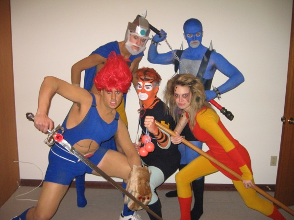

# Thundercats

## Members
* Lionel (Lion-RaO)
* RaoRao (CheetaRao)
* Daniel(Mumm-Rao)
* Bruno (SnarfRao)

## Project
* Type Racer

## Lightning Talks

### Events - Rao Rao

* There are [tons of
  events](https://developer.mozilla.org/en-US/docs/Web/Reference/Events?redirectlocale=en-US&redirectslug=DOM%2FMozilla_event_reference)
  for all kinds of things
* You can bind events with an attribute in the HTML - DO NOT USE
* You can use [addEventListener](https://developer.mozilla.org/en-US/docs/Web/API/EventTarget)

